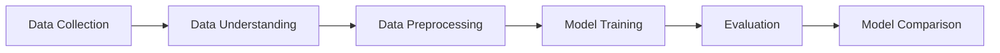
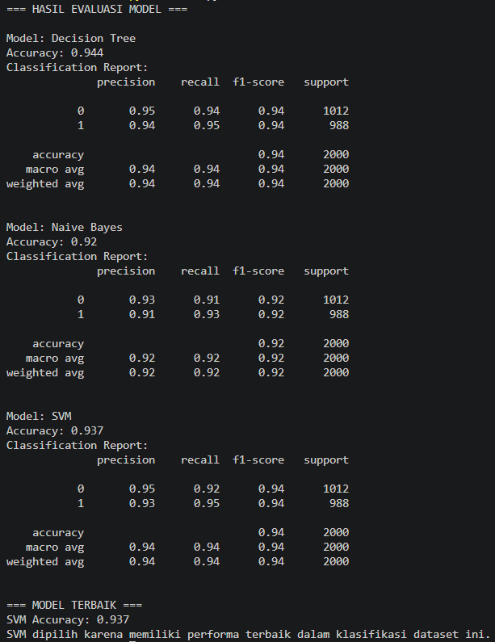

# 🍊 Orange vs Grapefruit Classification

### Machine Learning Project (UTS)


---

## 📌 Project Overview

Project ini bertujuan untuk membangun model *machine learning* yang mampu mengklasifikasikan buah menjadi **Orange (Jeruk)** atau **Grapefruit** berdasarkan karakteristik fisik seperti ukuran dan warna.

Pendekatan yang digunakan adalah **supervised learning (klasifikasi biner)** dengan membandingkan performa tiga algoritma:

* 🌳 Decision Tree
* 📊 Naive Bayes
* 📈 Support Vector Machine (SVM)

---

## 📂 Dataset

Dataset yang digunakan berasal dari Kaggle:

🔗 https://www.kaggle.com/datasets/joshmcadams/oranges-vs-grapefruit

### 🔍 Fitur Dataset:

* `diameter` → ukuran buah
* `weight` → berat buah
* `red`, `green`, `blue` → representasi warna
* `name` → label (orange / grapefruit)

---

## ⚙️ Workflow Machine Learning



---

## 🧪 Data Preprocessing

Tahapan preprocessing yang dilakukan:

* Label Encoding (`orange = 0`, `grapefruit = 1`)
* Feature Selection
* Train-Test Split (80:20)
* Feature Scaling menggunakan **StandardScaler** (khususnya untuk SVM)

---

## 🤖 Models Used

### 🌳 Decision Tree

* Mudah diinterpretasikan
* Cocok untuk baseline model
* Risiko overfitting

### 📊 Naive Bayes

* Cepat dan efisien
* Berbasis probabilistik
* Asumsi independensi fitur

### 📈 Support Vector Machine (SVM)

* Mencari hyperplane optimal
* Akurasi tinggi
* Sensitif terhadap skala data

---

## 📊 Evaluation Results



### 🔢 Ringkasan Performa:

| Model         | Accuracy  |
| ------------- | --------- |
| Decision Tree | **0.944** |
| Naive Bayes   | 0.920     |
| SVM           | 0.937     |

---

## 🧠 Analysis & Insight

* **Decision Tree** memiliki akurasi tertinggi, namun cenderung *overfitting* pada data training.
* **Naive Bayes** memiliki performa paling rendah karena asumsi independensi fitur yang tidak sepenuhnya terpenuhi.
* **SVM** memberikan performa yang sangat stabil dengan generalisasi yang lebih baik.

👉 Oleh karena itu, **SVM dipilih sebagai model terbaik** karena keseimbangan antara akurasi dan kemampuan generalisasi.

---

## 🚀 How to Run

### 1. Clone Repository

```bash
git clone https://github.com/username/uts-ml-fruit.git
cd uts-ml-fruit
```

### 2. Install Dependencies

```bash
pip install -r requirements.txt
```

### 3. Run Program

```bash
python main.py
```

---

## 📁 Project Structure

```bash
uts-ml-fruit-classification/
│
├── dataset/
│   └── citrus.csv
├── images/
│   └── hasil-evaluasi.png
├── main.py
├── notebook/
│   └── model.ipynb
├── README.md
└── requirements.txt
```

---

## 🧾 Requirements

```bash
pandas
scikit-learn
numpy
```

---

## 🎯 Conclusion

* Model machine learning dapat digunakan untuk klasifikasi buah dengan akurasi tinggi.
* Perbandingan model menunjukkan bahwa:

  * Decision Tree unggul dalam akurasi
  * SVM unggul dalam stabilitas dan generalisasi
* **SVM dipilih sebagai model terbaik untuk kasus ini**

---

## ✍️ Author

**Nama:** [Nazwa Zalfa]
**NIM:** [1237050116]
**Mata Kuliah:** Machine Learning

---

## ⭐ Notes

Project ini dibuat untuk memenuhi tugas **Ujian Tengah Semester (UTS)** dan dapat dikembangkan lebih lanjut dengan:

* Hyperparameter tuning (GridSearchCV)
* Visualisasi data
* Deployment model

---
